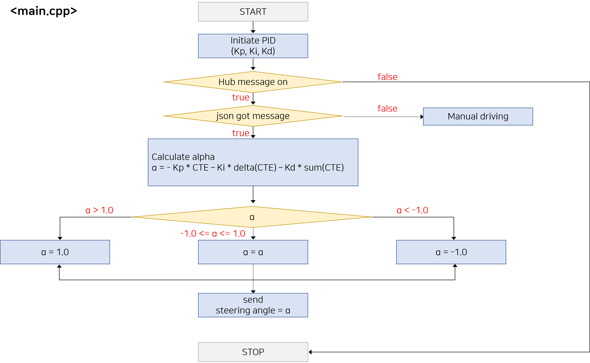

# SELF DRIVING CAR NANODEGREE
# project8. PID-control

## 1. Abstraction

The purpose of this project is to drive in simulation

Simulation map is same as Behavior cloning project

But it has a big difference in the approach

Behavior cloning used deep learning to teach simulator to drive

To do that, I need to drive myself to collect steering angle data

But PID control need not any data

It just controls steering angle or speed by calculation

It is affected by only CTE (Cross Track Error) and several coefficient

So only important thing is tuning coefficients and decide how to use this result

I receive 3 kinds of data as input

For every "telemetry"
- CTE (Cross Track Error)
- speed
- steering angle

And I should calculate 2 kinds of data as outpout

For every "telemetry"
- steering angle
- throttle

Clearly, I need to calculate steering angle by using Kp, Ki, Kd

But firstly, I concerned about controlling speed or not

Controlling speed means calculate speed by using Kp, Ki, Kd every time when value is updated

So I thought about the method real human drive

When I drive and have to pass curve, I speed up at straight lane,

and shortly before curve, slow down to pass a curve safely

And I concluded it is difficult to act like this only using CTE information

To do that, I need map data, and need to know where the curve is, so where do I have slow down

So, I excluded speed in my have to control list

The rest of duty is only parameter tuning

And I tried not using twiddle but just try case by case


## 2. Related Study

#### 1) PID control

To control steering angle, we can calculate its angle by

alpha = -Kp * CTE -Ki * delta(CTE) - Kd * sum(CTE)

It is reason why being called PID control

There are 3 coefficient Kp, Ki, Kd

1) P means "Propotional"

	It affect to steering to turn as much as you are apart from target position

2) I means "Integral"

	It is important when my car allignment is not good so it cannot go straight even though steering is straight

3) D means "Differential"

	It can prevent oscillation of car

	When using only P term, the car will oscillate inevitably


## 3. Details

#### 1) Content Of This Repo

- ```src``` a directory with the project code
	- ```main.cpp``` : communicate with simulator, reads in data, calls a function in PID.h to drive
	- ```PID.h``` : header file of PID
	- ```PID.cpp``` : have functions have to be used in main.cpp

#### 2) Code

① main.cpp



```c++
#include <math.h>
#include <uWS/uWS.h>
#include <iostream>
#include <string>
#include "json.hpp"
#include "PID.h"

using nlohmann::json;
using std::string;

constexpr double pi() { return M_PI; }
double deg2rad(double x) { return x * pi() / 180; }
double rad2deg(double x) { return x * 180 / pi(); }

string hasData(string s) {
  auto found_null = s.find("null");
  auto b1 = s.find_first_of("[");
  auto b2 = s.find_last_of("]");
  if (found_null != string::npos) {
    return "";
  }
  else if (b1 != string::npos && b2 != string::npos) {
    return s.substr(b1, b2 - b1 + 1);
  }
  return "";
}

int main() {
  uWS::Hub h;

  PID pid;
  // pid.Init(0.1, 0.0, 0.0);
  // pid.Init(0.1, 0.1, 0.0);
  // pid.Init(0.1, 0.0, 0.1);
  // pid.Init(0.1, 0.0, 0.5);
  pid.Init(0.13, 0.0, 0.8);

  h.onMessage([&pid](uWS::WebSocket<uWS::SERVER> ws, char *data, size_t length, 
                     uWS::OpCode opCode) {

    if (length && length > 2 && data[0] == '4' && data[1] == '2') {
      auto s = hasData(string(data).substr(0, length));

      if (s != "") {
        auto j = json::parse(s);

        string event = j[0].get<string>();

        if (event == "telemetry") {

          double cte = std::stod(j[1]["cte"].get<string>());
          //double speed = std::stod(j[1]["speed"].get<string>());
          //double angle = std::stod(j[1]["steering_angle"].get<string>());
          double steer_value;
          
          pid.UpdateError(cte);
          steer_value = pid.TotalError();
          if (steer_value > 1.0)
          {
            steer_value = 1.0;
          }
          else if (steer_value < -1.0)
          {
            steer_value = -1.0;
          }
          
          std::cout << "CTE: " << cte << " Steering Value: " << steer_value 
                    << std::endl;

          json msgJson;
          msgJson["steering_angle"] = steer_value;
          msgJson["throttle"] = 0.3;
          auto msg = "42[\"steer\"," + msgJson.dump() + "]";
          std::cout << msg << std::endl;
          ws.send(msg.data(), msg.length(), uWS::OpCode::TEXT);
        }  // end "telemetry" if
      } else {
        // Manual driving
        string msg = "42[\"manual\",{}]";
        ws.send(msg.data(), msg.length(), uWS::OpCode::TEXT);
      }
    }  // end websocket message if
  }); // end h.onMessage

  h.onConnection([&h](uWS::WebSocket<uWS::SERVER> ws, uWS::HttpRequest req) {
    std::cout << "Connected!!!" << std::endl;
  });

  h.onDisconnection([&h](uWS::WebSocket<uWS::SERVER> ws, int code, 
                         char *message, size_t length) {
    ws.close();
    std::cout << "Disconnected" << std::endl;
  });

  int port = 4567;
  if (h.listen(port)) {
    std::cout << "Listening to port " << port << std::endl;
  } else {
    std::cerr << "Failed to listen to port" << std::endl;
    return -1;
  }
  
  h.run();
}
```

② PID

###### PID.h

```c++
#ifndef PID_H
#define PID_H

class PID {
 public:

  PID();

  virtual ~PID();

  void Init(double Kp_, double Ki_, double Kd_);

  void UpdateError(double cte);

  double TotalError();

 private:

  double p_error;
  double i_error;
  double d_error;

  double Kp;
  double Ki;
  double Kd;
  
  double prev_cte;
  double del_cte;
  double sum_cte;
};

#endif  // PID_H
```

###### PID.cpp

```c++
#include "PID.h"

PID::PID() {}

PID::~PID() {}

void PID::Init(double Kp_, double Ki_, double Kd_) {
  
  Kp = Kp_;
  Ki = Ki_;
  Kd = Kd_;
  
  p_error = 0.0;
  i_error = 0.0;
  d_error = 0.0;
  
  prev_cte = 0.0;
  del_cte = 0.0;
  sum_cte = 0.0;
}

void PID::UpdateError(double cte) {

  p_error = cte * Kp;

  del_cte = cte - prev_cte;
  prev_cte = cte;
  d_error = del_cte * Kd;

  sum_cte += cte;
  i_error = sum_cte * Ki;
}

double PID::TotalError() {

  return - p_error - i_error - d_error;
  
}
```

## 4. Results

It drove well without leaving the lane


## 5. Discussion

#### 1) About parameter tuning

Firstly, I concluded not to use Ki

Because it is only useful when allignment of car is not good

But it is simulation, so allignment will be perfect, so I set Ki = 0.0

Secondl, I set only Kp = 0.1

And anticipated it will oscillate but I just wonder it can react at sharp curve

But without Kd, even a little curve caused oscillation and makes it larger and larger

So it cannot go farther

Thirdly, I added Kd = 0.1 (Kp = 0.1)

Relativly, it drove little better than before one

But it is insufficient to resist to oscillation

Fourthly, I raised the Kd = 0.5 (Kp = 0.1)

Expectedly, it drove one lap successfully

Comparing to before one, it can endure better at oscillation

So I concluded Kp means the ability to react at curve

and Kd means ability of stabilization

By that conclusion, I think it will better to raise Kp more,

and to counter balance that effect, also need to raise Kd

And Kp is muliplied to CTE, but Kd is multiplied to delta(CTE)

So Kd should much larger than Kp to affect equally to steering angle

Finally I selected Kp = 0.13, Kd = 0.8, Ki = 0.0


